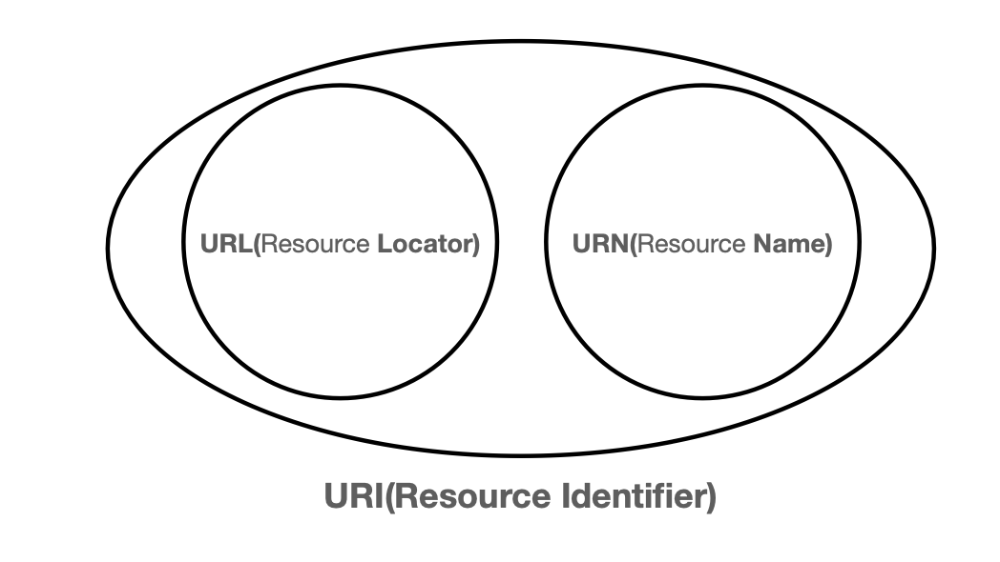

# URI, URL??

# URI(Uniform Resource Identifier)

“URI는 로케이터(Locator), 이름(name) 또는 둘 다 추가로 분류될 수 있다.”

- Uniform : 리소스를 식별하는 통일된 방식
- Resource : 자원, URI로 식별할 수 있는 모든 것(제한 없음)
- Identifier : 다른 항목과 구분하는데 필요한 정보

## URL, URN

- URL - Locator : 리소스가 있는 위치를 지정
- URN - Name : 리소스에 이름을 부여
- 위치는 변할 수 있지만, 이름은 변하지 않는다.
- URN 이름만으로 실제 리소스를 찾을 수 있는 방법이 보편화 되지 않았음
- 정확하게 URI와 URL은 다르긴 하지만 보편적으로 URI==URL로 말함

## URL의 전체 문법

- scheme://[userinfo@]host[:port][/path][?query][#fragment]
- https://www.google.com:443/search?q=hello&hl=ko

- 프로토콜(https)
- 호스트명(www.google.com)
- 포트 번호(443)
- 패스(/search)
- 쿼리 파라미터(q=hello&hl=ko)

### scheme

- **scheme:**//[userinfo@]host[:port][/path][?query][#fragment]
- **https:**//www.google.com:443/search?q=hello&hl=ko

- 주로 프로토콜 사용
- 프로토콜이란? 어떤 방식으로 자원에 접근할때 필요한 약속, 규칙

### userinfo

- scheme://**[userinfo@]**host[:port][/path][?query][#fragment]
- https://www.google.com:443/search?q=hello&hl=ko

- URL에 사용자정보를 포함해서 인증
- 거의 사용하지 않음

### host

- scheme://[userinfo@]**host**[:port][/path][?query][#fragment]
- https://**www.google.com**:443/search?q=hello&hl=ko

- 호스트명
- 도메인명 또는 IP 주소

### port

- scheme://[userinfo@]host**[:port]**[/path][?query][#fragment]
- https://www.google.com**:443**/search?q=hello&hl=ko

- 접속 포트
- 일반적으로 생략, 생략시 http는 80, https는443

### path

- scheme://[userinfo@]host[:port]**[/path]**[?query][#fragment]
- https://www.google.com:443**/search**?q=hello&hl=ko

- 리소스 경로, 계층적구조

### query

- scheme://[userinfo@]host[:port][/path]**[?query]**[#fragment]
- https://www.google.com:443/search?**q=hello&hl=ko**

- key=value 형태
- ?로 시작, &로 추가 가능
- query parameter, query string 등으로 불림
- 웹서버에 제공하는 파라미터, 문자 형태

### fragment

- scheme://[userinfo@]host[:port][/path][?query]**[#fragment]**
- https://docs.spring.io/spring-boot/docs/current/reference/html/getting-started.html**#getting-started-introducing-spring-boot**

- html 내부 북마크 등에 사용
- 서버에 전송하는 정보 x