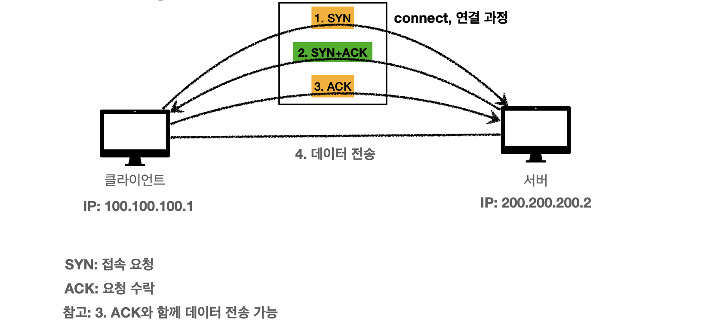
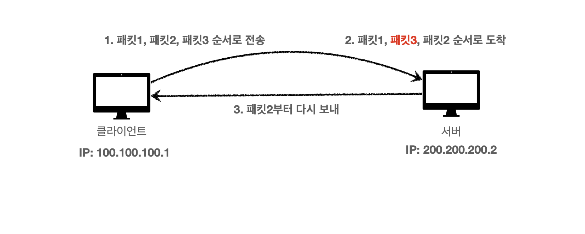

# TCP

전송 제어 프로토콜(Transmission Control Protocol)

- 연결지향 - TCP 3 way handshake
- 데이터 전달 보증
- 순서보장
- 신뢰할 수 있는 프로토콜
- 현재는 대부분 TCP 사용

### 3 way handshake?

### 순서 보장

# UDP

사용자 데이터그램 프로토콜(User Datagram Protocol)

- 하얀 도화지에 비유(기능이 거의 없음)
- 연결지향 X
- 데이터 전달 보증 X
- 순서 보장 X
- 데이터 전달 및 순서가 보장되지 않지만, 단순하고 빠름
- IP+PORT+체크섬 의 형태
- 애플리케이션에서 추가 작업 필요